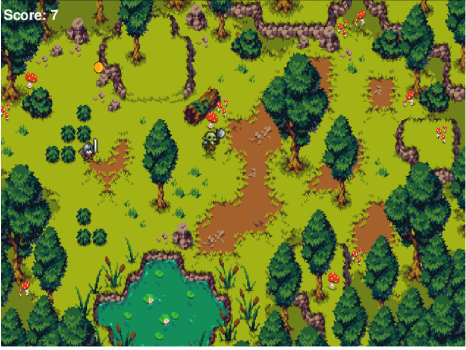

# Knight-Man

A fast-paced coin collection survival game built with Pygame and deployed to the web using pygbag.

## Play Now
https://cellohh.github.io/knight-man/

## Controls
- Arrow Keys / WASD – Move
- Shift + G – God Mode (Cheat)
- R – Restart

## Features
- Boss at 50 coins
- Multiple enemies
- Particle effects
- Cheater vs Legit endings

- 

- Credits:
Character assets -
https://zerie.itch.io/tiny-rpg-character-asset-pack/download/eyJpZCI6MjY2MTkyOSwiZXhwaXJlcyI6MTc2NTQ2NzUxOX0%3d.5amVyHj20R5M7OiIT2mlhtIB7do%3d

Sounds - 
https://gamesupply.itch.io/video-game-sound-pack?download

Map - 
https://aamatniekss.itch.io/topdown-fantasy-forest/download/eyJpZCI6NDU5NTAzLCJleHBpcmVzIjoxNzY1NDcwMzczfQ%3d%3d.XaaVNOsee9egBMD3cnIf5MepxAI%3d
